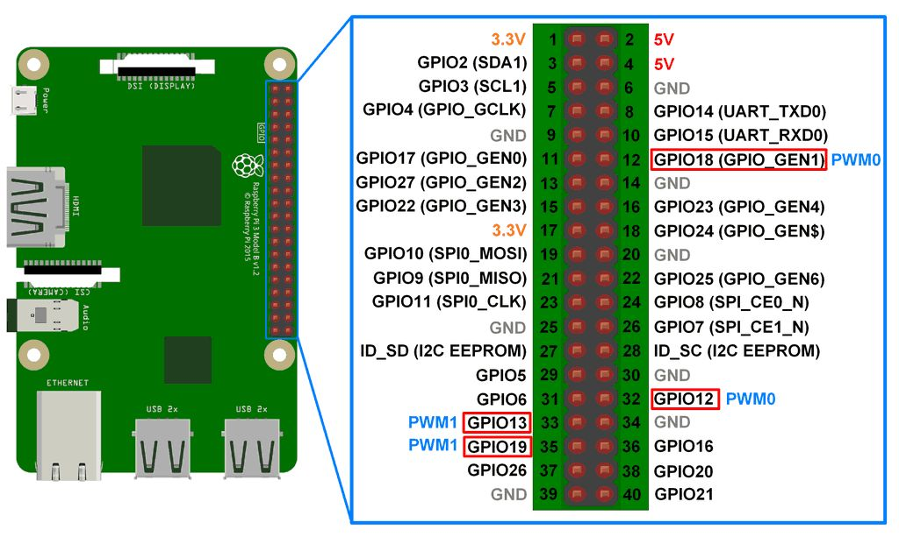

# Welcome to PAI's documentation!
This file is a test 2

## Raspbery pin out 

driver 1

- GND : 34
- PWM2: 33 (GPIO 13)
- PWM1: 32 (GPIO 12)
- DIR2: 31 (GPIO 6)
- DIR1: 29 (GPIO 5)
- EN: 26 (GPIO 7)
- FAULT: 24 (GPIO 8)

driver 2

- GND : 14
- PWM2: 13 (GPIO 27)
- PWM1: 12 (GPIO 18)
- DIR2: 11 (GPIO 17)
- DIR1: 10 (GPIO 15)
- EN: 8 (GPIO 14)
- FAULT: 7 (GPIO 4 )
